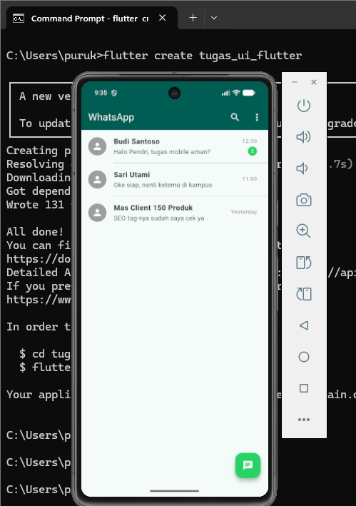
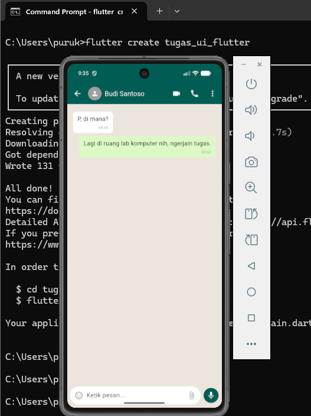

# Tugas UI/UX Flutter — WhatsApp UI

## Identitas
- **Nama:** Pendri Mikola
- **NIM:** 2455201110020
- **Pilihan:** A (WhatsApp Chat List + Halaman Percakapan)

## Deskripsi Singkat
Aplikasi ini merupakan replikasi antarmuka (UI) dari aplikasi populer WhatsApp versi Android untuk memenuhi tugas mata kuliah Pemrograman Mobile (Pertemuan UI/UX & Widget Design). Halaman yang diimplementasikan meliputi:
1. **Halaman Chat List (`ChatListPage`):** Menampilkan daftar obrolan aktif lengkap dengan foto profil (avatar), nama, cuplikan pesan terakhir, waktu, serta lencana (badge) jumlah pesan yang belum dibaca.
2. **Halaman Ruang Obrolan (`ChatRoomPage`):** Menampilkan simulasi percakapan interaktif menggunakan komponen *bubble chat* yang membedakan posisi pesan pengirim (kanan) dan penerima (kiri), serta dilengkapi dengan bar input pesan di bagian bawah.

## Widget yang Digunakan
- **Scaffold:** Digunakan sebagai struktur dasar atau kerangka halaman yang menyediakan tempat untuk `appBar`, `body`, dan `floatingActionButton`.
- **ListView / ListView.separated:** Digunakan untuk me-render daftar chat secara dinamis, rapi, dan hemat memori dengan adanya garis pemisah (`Divider`) otomatis antar item.
- **ListTile:** Komponen khusus untuk menyusun elemen visual chat (avatar di bagian `leading`, nama di `title`, teks pesan di `subtitle`, dan waktu di `trailing`) secara instan dan presisi.
- **CircleAvatar:** Digunakan untuk membuat komponen foto profil berbentuk lingkaran, baik pada daftar chat maupun pada bagian header room chat.
- **Column & Row:** Widget tata letak utama untuk menyusun elemen secara vertikal (seperti susunan chat) dan horizontal (seperti elemen di dalam bar input pesan dan header chat).
- **Expanded:** Digunakan di dalam `ChatRoomPage` agar daftar obrolan dapat mengambil sisa ruang layar yang tersedia secara fleksibel tanpa merusak posisi bar input pesan di bagian bawah.

## Screenshot
### Halaman Daftar Chat (Chat List)

### Halaman Ruang Obrolan (Chat Room)

## Wireframe

## Kesulitan yang Ditemui
1. **Penyusunan Tata Letak & Masalah Overflow:** Kendala teknis utama yang dihadapi adalah mengatur agar bar input pesan di bagian bawah halaman `ChatRoomPage` tidak terdorong keluar layar atau mengalami *overflow* saat daftar chat bertambah banyak. Masalah ini berhasil diatasi dengan membungkus `ListView` ruang obrolan menggunakan widget `Expanded`, sehingga daftar chat tetap dapat di-scroll dengan aman di dalam sisa ruang yang tersedia di atas bar input.
2. **Akurasi Replikasi Desain (Wireframe ke Kode):** Cukup sulit untuk membuat implementasi kode Flutter bisa 100% presisi dan sesuai dengan sketsa manual/wireframe yang telah digambar sebelumnya. Beberapa penyesuaian *spacing* (menggunakan `SizedBox` dan `Padding`) serta penataan ukuran font harus disesuaikan secara berulang kali di emulator agar layout akhir tetap terlihat proporsional dan nyaman dilihat tanpa merusak struktur dasar dari sketsa awal.